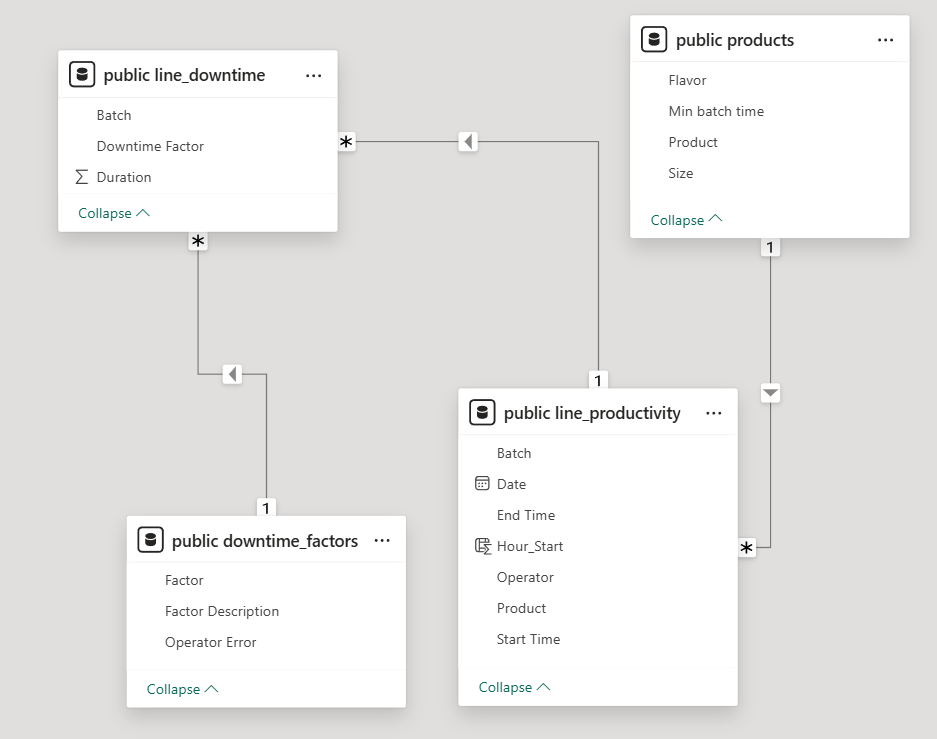
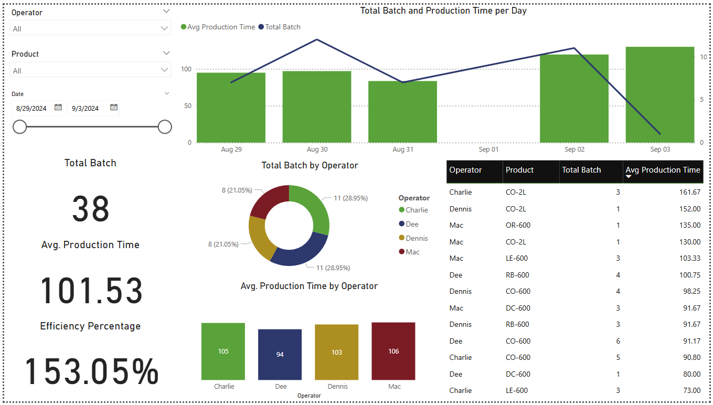
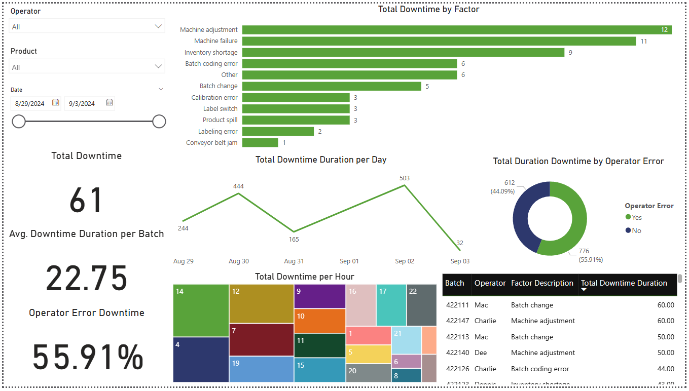

# Production Productivity Dashboard

## Project Overview
This Power BI dashboard analyzes **production productivity** and **downtime factors** in a manufacturing setting. It provides insights into batch efficiency, operator performance, and potential bottlenecks.

## Dataset Information
The project uses multiple datasets with the following entity-relationship diagram:

## Dashboard Layout
### Page 1: Production Performance

### Page 2: Downtime Analysis

## Key Insights
- The average production time per batch is **102 minutes**, exceeding the standard batch time, resulting in an **efficiency of 153%**.
- The most efficient operator is **Dee (94 minutes avg.)**, while **Mac** has the slowest production time.
- The **average downtime per batch** is **22 minutes**, with the longest downtime recorded at **1 hour**.
- The top downtime cause is **Machine Adjustment (24% of total downtime)**.
- **56% of downtime is caused by operator errors**, indicating potential training gaps.
- **Peak downtime occurs at 2 PM (14:00)**, suggesting a need for further investigation.

## Recommendations
- **Reduce production time** by applying best practices from top-performing operators.
- **Minimize downtime** by optimizing maintenance schedules and providing targeted operator training.
- **Monitor critical hours** (e.g., 2 PM) and implement alerts to proactively address downtime risks.

## How to Use This Project
1. Download the `.pbix` file and open it in **Power BI Desktop**.
2. Connect to the dataset (CSV files) or use the following credentials to connect to **NeonDB**:
   - **PGHOST:** `ep-tight-haze-a8paosk3-pooler.eastus2.azure.neon.tech`
   - **PGDATABASE:** `neondb`
   - **PGUSER:** `neondb_public`
   - **PGPASSWORD:** `npg_BuzdvxRjw58Z`
3. Adjust filters & slicers to explore insights.
4. Modify visualizations as needed.
